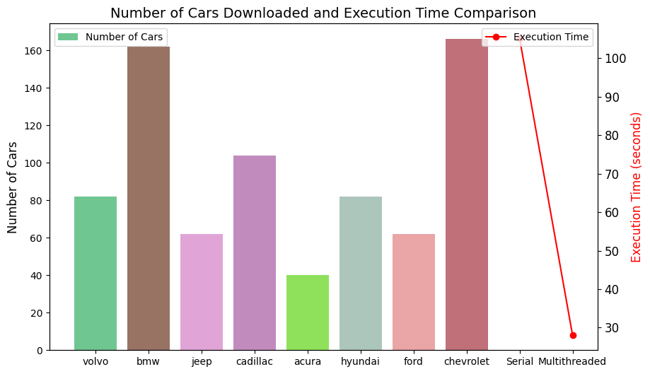

Certainly! Here's a more complete version of the README with additional details and improvements:

```markdown
# Cars Scraper

The Cars Scraper is a Python script designed to scrape car information from a website and generate a summary chart for the number of cars downloaded and execution time comparison.

## Table of Contents
- [Overview](#overview)
- [Requirements](#requirements)
- [Installation](#installation)
- [Usage](#usage)
- [Example](#example)
- [Summary Chart](#summary-chart)
- [Contributing](#contributing)
- [License](#license)

## Overview

The Cars Scraper is built to extract information about cars from a specified website. It supports both serial and multithreaded implementations for faster data retrieval.

## Requirements

- Python 3.x
- Requests library (`requests==2.31.0`)
- BeautifulSoup library (`beautifulsoup4==4.12.3`)
- Pandas library (`pandas==2.2.0`)
- Matplotlib library (`matplotlib==3.4.3`)
- Concurrent Futures library (included in Python standard library)

## Installation

1. **Clone the repository:**

   ```bash
   git clone https://github.com/your-username/cars-scraper.git
   ```

2. **Navigate to the project directory:**

   ```bash
   cd cars-scraper
   ```

3. **Install the required dependencies:**

   ```bash
   pip install -r requirements.txt
   ```

## Usage

Run the script using the following command:

```bash
python cars_scraper.py
```

The script will perform both serial and multithreaded scraping of car information based on the specified categories and URLs.

## Example

```python
# Example usage
categories = ['volvo', 'bmw', 'jeep', 'mercedes_benz']
url = "https://www.cars.com/shopping/results/?makes[]=volvo&maximum_distance=all&stock_type=all&zip="

# Example with max_pages
max_pages = {'volvo': 3, 'bmw': 1, 'jeep': 2, 'mercedes_benz': 4}
scraper = CarsScraper(url, categories, max_pages)

# Phase 1: Serial Implementation
scraper.scrape_cars_serial()

# Phase 2: Multithreaded Implementation
scraper.scrape_cars_multithreaded()

# Summary Chart
scraper.summary_chart()
```

## Summary Chart

The summary chart displays the number of cars downloaded for each category and compares the execution time between serial and multithreaded implementations.



## Contributing

Contributions are welcome! Feel free to submit issues or pull requests.

## License

This project is licensed under the [MIT License](LICENSE).
```

Make sure to replace the versions and dependencies with your actual dependencies from your `requirements.txt` file.